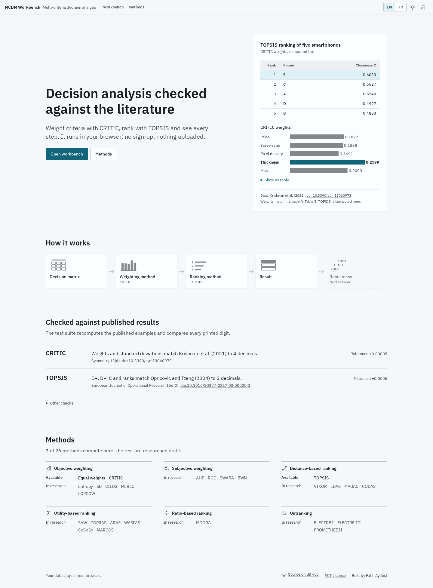
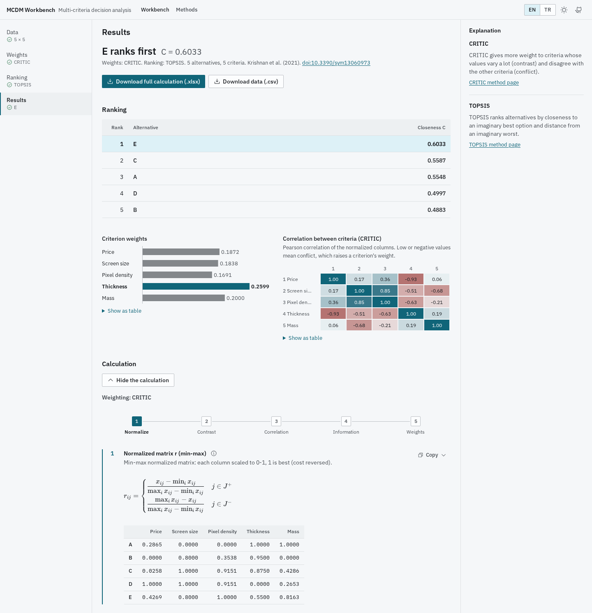
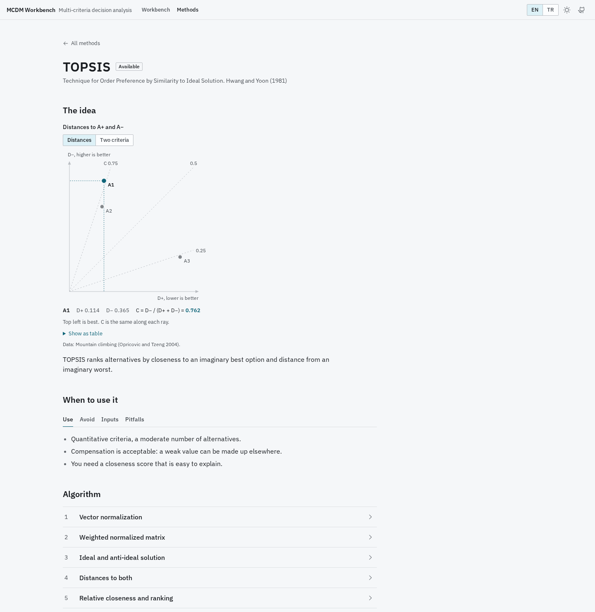

# MCDM Workbench

A browser tool for multi-criteria decision analysis: weight criteria with CRITIC, rank alternatives with TOPSIS and read every intermediate step, in English or Turkish.

**Live demo:** https://fatihaydost.github.io/kds-topsis-critic/



## What it does

- Enter a decision matrix in a spreadsheet-like grid, paste it from Excel or import `.xlsx` / `.csv`, and mark each criterion as benefit or cost.
- Weights from CRITIC, equal weights or your own; ranking by TOPSIS with a closeness score per alternative.
- Shows the worked calculation step by step, with formulas and labelled matrices; copy any step as TSV or LaTeX, or download the whole calculation as `.xlsx`.
- Runs entirely in the browser: no sign-up, no server, nothing uploaded.



## Verified against the literature

The test suite recomputes published examples and compares every printed digit:

| Method | Reference | What is compared | Tolerance |
|---|---|---|---|
| CRITIC | Krishnan et al. (2021), Symmetry 13(6):973, Tables 1, 2 and 5 | standard deviations and weights | ±0.00005 |
| TOPSIS | Opricovic and Tzeng (2004), EJOR 156(2):445, Table 3, two unit variants | D+, D−, closeness and ranks | ±0.0005 |

CRITIC is also checked against the hand-solved spreadsheet from the original coursework (`legacy/CRITIC(2).xlsx`) and the full CRITIC + TOPSIS chain against the legacy Python code, both to 10⁻¹². Fixtures are in [`tests/fixtures/`](tests/fixtures).

## Methods

3 methods compute today (CRITIC, equal weights, TOPSIS) and 23 more are researched and documented, each with its own page: [methods catalogue](https://fatihaydost.github.io/kds-topsis-critic/methods).



## Tech

React 19, TypeScript, Vite, Tailwind CSS 4, Radix UI, KaTeX, SheetJS, i18next; Vitest and Playwright; static build on GitHub Pages.

## Run locally

Needs Node 24 or newer and pnpm.

```sh
pnpm i
pnpm dev      # http://localhost:5173
pnpm test     # unit tests
pnpm e2e      # Playwright end-to-end tests
```

## Docs

- [Design notes](docs/design/DESIGN.md)
- [Method research](docs/research/)

## Project history

Started as a Flask coursework app for CRITIC and TOPSIS; that version is kept unchanged in [`legacy/`](legacy).

## License

[MIT](LICENSE)
